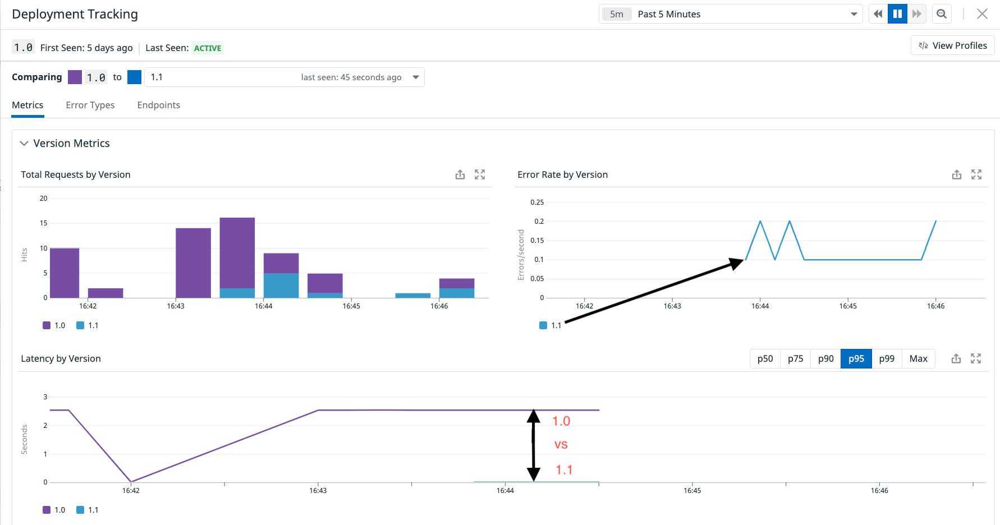
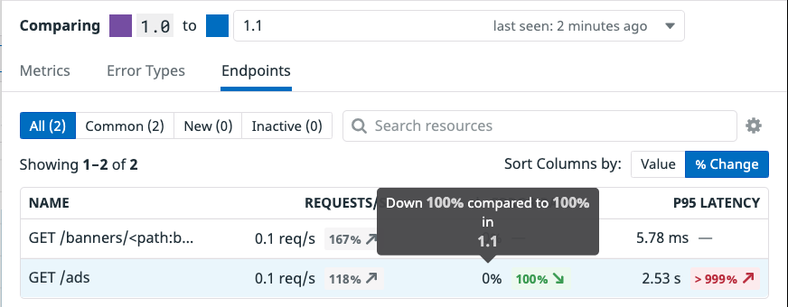
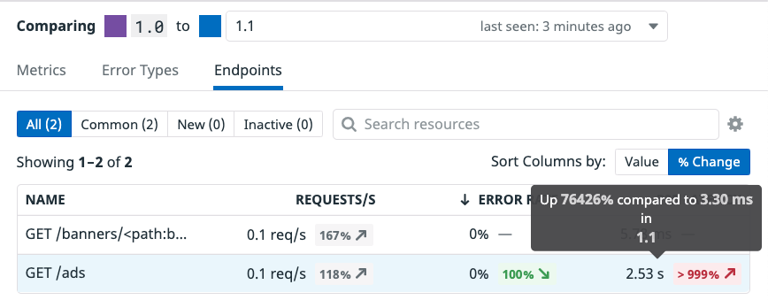

With both the `1.0` and `1.1` versions running and showing in the `Deployment` pane, click on the `1.0` deployment. Deployment Tracking for Datadog distributed tracing and APM tracks all versions deployed over the last 30 days, giving you a wide window for continuous deployment analysis. Datadog automatically provides out-of-the-box graphs that visualize RED (requests, errors, and duration) metrics across versions, making it easy to spot problems in your services and endpoints before they turn into serious issues.

From the image above you can see the high latency shown in purple as opposed to the much lower latency shown in blue. In the `Error Rate by Version` we can see an error trend in the `1.1` (blue) deployment where you will see zero errors, or no purple line, for the `1.0`. 

Let's quickly dig in and investigate this a bit more to see whats going on. From the `Metrics` tab, click the `Endpoints` tab. This will show you the endpoints associated with this service, the requests per second coming in, the error rate, along with the P95 Latency. These are all comparisons between another chosen version, so you can see how error rates and latency differ between deployments. We can see that our `Error Rate` when looking at the `1.0` deployment has a `100%` reduction in errors from the newer `1.1` deployment, along with the p95 latency being over `1000%` higher

With this increase massive increase in errors, we need to take this deployment down before too many customers experience issues. Thankfully, the canary-like strategy used here has decreased the blast radius.
