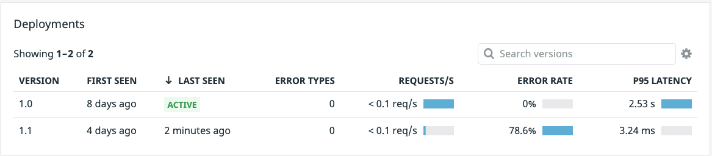

1. In the terminal to the right, execute the following command: `kubectl delete deployments advertisements-canary`{{execute}}.

Heading back over to the [APM > Services > advertisements](https://app.datadoghq.com/apm/service/advertisements) page, looking down at your Deployments you should shortly see that only the version `1.0` is `Active`. 

Now that you have taken down the bad deployment and ensured no users will encounter any errors, you can get a new image from the engineering team. So while your users are still experiencing a bit of lag in load times with some infrequent errors, at least they are not experiencing constant errors.

With the failure of version `1.1`, word of a new useable and tested image from the engineering team has been quickly handed down. Again, they have provided a new manifest, but you will still need to update the version number. If you do not update the version numbers, you will not receive proper data about this specific version you are about to deploy. Remember, Datadog Deployment tracking relies on the reserved  `version` tag, and if it is not properly updated you will not receive relevant data for this new deployment.

1. First copy the new manifest into the `k8s-yaml-files` directory. `cp /root/new-manifests/advertisements_1_2.yaml /root/k8s-yaml-files/advertisements.yaml`{{execute}}

1. In the IDE on the right, open your newly copied manifest `/root/k8s-yaml-files/advertisements.yaml`{{open}}.

1. On lines 9 and 26, update the version numbers from `1.1` to `1.2`. This is the tag that allows Datadog to track the version. 

Now you can deploy what is hopefully going to be a minor update that gives your end user the latency, error free experience they deserve! Apply the `1.2` manifest using `kubectl apply -f k8s-yaml-files/advertisements.yaml`{{execute}}. 

In the next step we will take a look at our new `advertisements-canary` deployment.